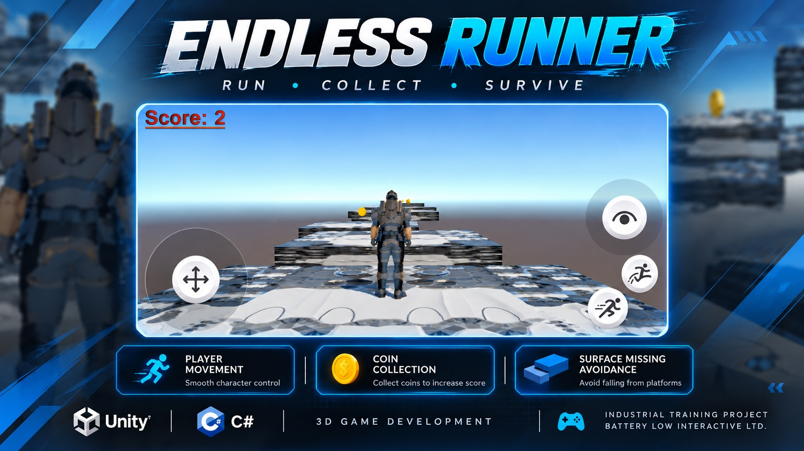

# Endless Runner

A 3D Endless Runner prototype developed in Unity during my industrial training at Battery Low Interactive Ltd.

## Overview

This project was developed as an early game-development exercise to learn and practice core Unity concepts before moving into AR-focused development.

The player continuously runs through a 3D environment while collecting coins and avoiding surface misses.

## Features

- Player running movement
- Continuous coin collection
- Surface missing avoidance
- Score system
- 3D environment
- Basic game mechanics
- Mobile-friendly controls

## Technologies

- Unity
- C#
- 3D Game Development

## Skills Practiced

- Unity scene setup
- 3D object handling
- C# scripting
- Game mechanics
- Player movement
- Collision handling
- UI and score management

# Endless Runner

A 3D Endless Runner prototype developed in Unity during my industrial training at Battery Low Interactive Ltd.

## Project Preview

## Gameplay Demo

[Watch the Gameplay Demo](Assets/endless-runner-demo.mp4)

## Industrial Training

This prototype was developed as part of my industrial training in AR/VR/XR Development at Battery Low Interactive Ltd.
